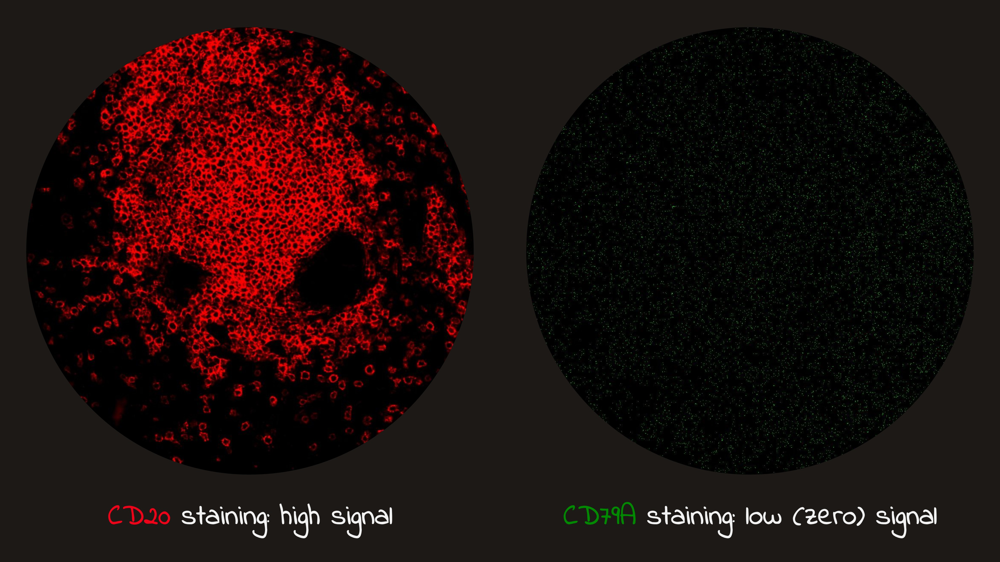

---
kernelspec:
  display_name: jb
  language: python
  name: python3
---

# Introduction to bioimage analysis


```{note} Plan
- Why images matter in modern biology
- Core image basics: pixels, shapes, channels, and intensity
- How to load simple images in Python
- Common conventions in `scikit-image` and `OpenCV`
- Why noise and metadata matter for later analysis
```

In recent years, biology has become increasingly spatial: it is no longer enough to know what molecules are present—we also want to know **where** they are in tissue. This shift is reflected in the choices of Nature Methods “Method of the Year”: spatially resolved transcriptomics in 2020 and spatial proteomics in 2024.

Both advances rely on images as a primary data source. That makes bioimage analysis not a “nice-to-have”, but the bridge between raw spatial measurements and biological insight.

::::{grid} 2
:::{grid-item}
[](https://www.nature.com/articles/s41592-024-02565-3)
:::
:::{grid-item}
[](https://www.nature.com/articles/s41592-020-01042-x)
:::
::::

```{admonition} Time-capsule note
:class: dropdown

If you are reading this from the future and these “Method of the Year” picks have changed—great, science kept moving. In *our* timeline: **2020 = spatial transcriptomics**, **2024 = spatial proteomics**. Either way, the message still stands: biology is getting **more spatial**, and images are the data.
```

## What is bioimage analysis?

Bioimage analysis is the process of turning biological images into numbers you can trust. A microscope gives you pixels; analysis gives you answers: how many cells are present, how large they are, how bright they are, where they are located, and how they change across conditions.

A helpful way to think about it: an image is a crowded stadium photo. Your biological question is rarely “what does the stadium look like?”—it is more often “how many people are there, where are they sitting, and what are they doing?” Bioimage analysis is the set of methods that turns that photo into a count, a map, and a table of measurements.

In this book the main focus is **Python**, because it is flexible, popular, and integrates well with scientific computing, statistics, and machine learning.

**Core Python packages used in this chapter:**

[](https://numpy.org/)
[](https://matplotlib.org/)
[](https://scikit-image.org/)
[](https://opencv.org/)

```{note}
You do not need to master every library at once. The important skill is learning what kind of object each library returns, and what conventions it uses.
```

## Set up Python environment

Before we touch pixels, let us make sure the basic tools are installed. Bioimage analysis often combines “scientific Python” (arrays, plots, statistics) with “image Python” (TIFF files, channels, filters, microscopy metadata). A clean environment helps keep these tools working together.

### Option A: `conda`

Conda is popular in scientific imaging because it handles compiled dependencies smoothly.

```bash
# 1) Create a fresh environment
conda create -n bioimg python=3.12 -y

# 2) Activate it
conda activate bioimg

# 3) Install core packages for this chapter
pip install opencv-python numpy matplotlib scikit-image
```

### Option B: `venv` + `pip`

If you prefer to avoid `conda`, use Python’s built-in environment tools.

```bash
python -m venv .venv

# macOS/Linux
source .venv/bin/activate

# Windows (PowerShell)
# .\.venv\Scripts\Activate.ps1
```

Then install packages:

```bash
pip install -U pip
pip install numpy matplotlib scikit-image opencv-python
```

## Image basics

Before we analyze images, we need to load them correctly and understand what kind of data we are working with. In bioimage analysis, this step is more important than it may first appear, because biological images come in many formats and often carry important metadata.

### Image file formats

Not all image files are created equal. The format determines:

- how pixel data is stored
- whether metadata is preserved, such as pixel size or channel information
- how easy it is to load the image in Python

**Common formats you will encounter:**

| Format | Description | Typical use |
| --- | --- | --- |
| `.png`, `.jpg` | Standard image formats | Figures, demos, quick visualization |
| `.tif` / `.tiff` | Flexible format that can store multi-dimensional data | Microscopy |
| `.ome.tif` | TIFF plus standardized microscopy metadata | Bioimaging workflows |
| `.czi`, `.lif`, `.nd2`, ... | Proprietary microscope formats | Raw acquisition data |

A practical point to remember: two files may contain similar pixel values, but very different amounts of metadata. In bioimage analysis, metadata often matters because it tells you things like pixel size, channels, z-slices, or timepoints.

```{note}
For this first lesson we will use simple image files such as `.png` so we can focus on the basic ideas. Real microscopy data is often grayscale, multi-channel, 16-bit, and stored in TIFF-like formats rather than RGB photographs.
```

### Images are arrays

:::{figure}
:label: fig-pixel-values
:align: center

<a href="images/chapter-1/Slide2.JPG" target="_blank" rel="noopener noreferrer">
  
</a>

Pixel values of enlarged view.
:::

Once an image is loaded into Python, it is usually represented as a **NumPy array**. That means an image is not a special magical object. It is numerical data arranged on a grid. For a grayscale image, the shape is often:
- `(H, W)`

For a color image, the shape is often:
- `(H, W, 3)` where: `H` = height, `W` = width, `3` = three color channels

So when you inspect an image in Python, one of the first things to check is:

- its shape
- its data type (`dtype`)
- its value range

````{admonition} Exercise: Is this image grayscale or color?
:class: tip

::::{tab-set}

:::{tab-item} Try it
Write code that checks whether `img` is a grayscale image or a color image.

- If the image has two dimensions, print `"grayscale"`.
- If the image has three dimensions, print `"color"`.
:::

:::{tab-item} Solution
```python
if img.ndim == 2:
    print("grayscale")
elif img.ndim == 3:
    print("color")
else:
    print("unknown image format")
```
:::

::::
````

Those three properties already tell you a lot about what kind of image you have.

[](images/chapter-1/Slide1.JPG)


### Loading standard images with `scikit-image`

Let us start with `scikit-image`, a library that is widely used in scientific Python and bioimage analysis. It works naturally with NumPy arrays and plays nicely with `matplotlib`.


```{code-cell}
from skimage import io
import matplotlib.pyplot as plt

url = 'https://github.com/vdsukhov/bioimage-analysis-course/blob/main/data/images/dapi.png?raw=true'

img = io.imread(url)

plt.imshow(img, cmap='gray')
plt.axis("off")
plt.gcf().set_facecolor('black')
```

```{code-cell}
print("Shape:", img.shape)
print("Type of the object:", type(img))
print("Dtype:", img.dtype)
print("Min/Max:", img.min(), img.max())
```

````{admonition} Image inspection helper
:class: tip

::::{tab-set}

:::{tab-item} Description
When working with a newly loaded image, it is a good habit to inspect a few basic properties before doing anything else. Since we will repeat these checks many times throughout the course, it is helpful to wrap them into a small utility function.
:::

:::{tab-item} Implementation
```{code-cell}
import numpy as np

def inspect_image(img, name="img"):
    print(f"Name: {name}")
    print(f"Type: {type(img)}")
    print(f"Shape: {img.shape}")
    print(f"Dtype: {img.dtype}")
    print(f"Min: {img.min()}")
    print(f"Max: {img.max()}")
    print(f"Dimensions: {img.ndim}")

    if img.ndim == 2:
        print("Interpretation: grayscale image")
    elif img.ndim == 3:
        print(f"Interpretation: image with {img.shape[-1]} channels")
    else:
        print("Interpretation: higher-dimensional image")

inspect_image(img)
```
:::

::::
````


This reads the image into a NumPy array. For a color image, `scikit-image` uses **RGB** channel order, which matches what `matplotlib` expects.

At this point, the most important observation is simple: even though we display it as an image, Python sees it as an array.

### Looking at image channels

If `img.shape` is `(H, W, 3)`, then the last axis stores the color channels. We can inspect them one by one.

```{code-cell}
from skimage.data import colorwheel
import matplotlib.pyplot as plt
plt.style.use('dark_background')

img = colorwheel()

print(f"Data type: {img.dtype}")
print(f"Shape: {img.shape}")

plt.imshow(img, cmap='gray')
plt.axis("off")
plt.show()
```

```{code-cell}
plt.figure(figsize=(15, 5))

plt.subplot(1, 3, 1)
plt.imshow(img[:, :, 0], cmap="Reds")
plt.title("Channel 0", color='white', size=30)
plt.axis("off")

plt.subplot(1, 3, 2)
plt.imshow(img[:, :, 1], cmap="Greens")
plt.title("Channel 1", color='white', size=30)
plt.axis("off")

plt.subplot(1, 3, 3)
plt.imshow(img[:, :, 2], cmap="Blues")
plt.title("Channel 2", color='white', size=30)
plt.axis("off")

plt.tight_layout()
plt.show()
```

Each slice, such as `img[:, :, 0]`, is just a 2D array of shape `(H, W)`.

For learners already comfortable with arrays, this is the main connection to make: image analysis starts with familiar array operations. Later, we will use the same idea for masking, measuring, filtering, and extracting signal from specific channels.

```{note}
This example assumes a 3-channel color image. A grayscale image usually has shape `(H, W)`, so indexing it as `img[:, :, 0]` would fail.
```

````{admonition} Exercise: Create a magenta-only view
:class: tip

::::{tab-set}

:::{tab-item} Try it
Create a copy of a color image where the **green channel is removed**, while the red and blue channels stay unchanged.

Display the result with `matplotlib`.
:::

:::{tab-item} Solution
```python
img_magenta = img.copy()
img_magenta[:, :, 1] = 0

plt.imshow(img_magenta)
plt.title("Red + Blue = Magenta")
plt.axis("off")
plt.show()
```
:::

::::
````

### Loading the same image with `OpenCV`

Now let us load the same file with `OpenCV`.

`OpenCV` is also a very common image-processing library. Just like `scikit-image`, it returns a NumPy array.

```python
import cv2
import matplotlib.pyplot as plt

img = cv2.imread("example.png")

print("Shape:", img.shape)
print("Type of the object:", type(img))
print("Dtype:", img.dtype)
print("Min/Max:", img.min(), img.max())

plt.imshow(img)
plt.title("OpenCV (raw)")
plt.axis("off")
```

At first glance, this looks very similar. But the displayed colors may be wrong.

Why? Because `OpenCV` uses a different color convention:

- `scikit-image` uses **RGB**
- `OpenCV` uses **BGR**

So the main lesson is not that the libraries return different kinds of objects—they do not. They both return arrays. The difference is in the **conventions** they use.

To display an OpenCV image correctly with `matplotlib`, convert it to RGB first:

```python
img_rgb = cv2.cvtColor(img, cv2.COLOR_BGR2RGB)

plt.imshow(img_rgb)
plt.title("OpenCV (converted to RGB)")
plt.axis("off")
```

**Small but useful habit**: when you load an image, get into the habit of chekcing:
- `img.shape`
- `img.dtype`
- `img.min()`, `img.max()`
These quick checks often catch mistakes early.

````{admonition} Exercise: Reorder color channels
:class: tip

::::{tab-set}

:::{tab-item} Try it
Write a code that takes an BGR image and converts is to RGB image. In this task don't use the `cv2.cvtColor` function and manually adjust the order of color channels.
:::

:::{tab-item} Solution
```python
img_rgb = img[:, :, ::-1]
```
:::

::::
````

````{admonition} Exercise: Compare image loading libraries
:class: tip

::::{tab-set}

:::{tab-item} Try it
Load the same image using both `scikit-image` and `OpenCV`.

Print the shape and dtype of each loaded image. Are they the same?
:::

:::{tab-item} Solution
```python
from skimage import io
import cv2

img_path = "" # specify path to an image

img_sk = io.imread(img_path)
img_cv = cv2.imread(img_path)

print("scikit-image:", img_sk.shape, img_sk.dtype)
print("OpenCV:", img_cv.shape, img_cv.dtype)
```
:::

::::
````


### Image intensity and bit depth

Image intensity is the numerical value stored at each pixel. We saw an example earlier in [this figure](#fig-pixel-values). In bioimage analysis, these values are not just "brightness"—they are a proxy for biological signal. The range of possible values is defined by the **bit depth** (data type).

The most common formats you will encounter are:

- **8-bit (`uint8`)**: Values from `0` to `255`. Common for standard photographs, but often too "coarse" for high-precision quantification and easy to **saturate** (clip) if the signal is bright.
- **16-bit (`uint16`)**: Values from `0` to `65,535`. The standard for raw microscopy data. It provides a high dynamic range, allowing you to distinguish subtle differences in dim and bright structures.
- **Float (`float32`)**: Values typically normalized between `0.0` and `1.0` (though they can be larger). Essential for mathematical operations—like filtering or deconvolution—to avoid rounding errors that occur with integers.

Looking only at `min` and `max` values gives us a rough summary of the image, but it does not tell us how intensities are distributed. A histogram is one of the simplest ways to inspect this, and it is often the first step in understanding contrast and dynamic range.

```{code-cell}
plt.figure(figsize=(6, 4))
plt.hist(img.ravel(), bins=32, edgecolor='white')
plt.xlabel("Pixel intensity")
plt.ylabel("Number of pixels")
plt.title("Histogram of image intensities")
plt.show()
```

| Bit Depth | Range | Why it matters |
| :--- | :--- | :--- |
| **8-bit** | 0 – 255 | Low storage; standard for web/display; prone to clipping. |
| **16-bit** | 0 – 65,535 | High precision; standard for raw scientific acquisition. |
| **Float** | 0.0 – 1.0 | High precision; avoids rounding errors during processing. |

In microscopy, intensity is influenced by staining, exposure time, and detector gain. When comparing intensities across images, always ensure they were collected under identical conditions and that no pixels have reached the maximum possible value ("clipping"), as this loses biological information.

### Noise and Signal-to-Noise Ratio (SNR)

Real biological images are never perfect. They always contain **noise**—unwanted variation in pixel values that does not come from the biology itself.

In microscopy, noise usually comes from two main sources:
- **Shot noise (Poisson noise)**: Caused by the random nature of photon arrival. Since photons arrive at the detector at random intervals, the signal "flickers" slightly. This is fundamental physics and is most noticeable in dim images.
- **Readout noise (Gaussian noise)**: Caused by the camera electronics during the process of converting light into a digital signal.

A critical concept is the **Signal-to-Noise Ratio (SNR)**. In bioimage analysis, we rarely care about the absolute amount of noise; we care about how strong our biological signal is compared to that noise.

| Property | Description |
| :--- | :--- |
| **High SNR** | The signal (e.g., a fluorescent cell) is much brighter than the noise. Easy to segment and measure accurately. |
| **Low SNR** | The signal is buried in noise. It becomes difficult to distinguish real biological structures from background "snow." |

:::{figure}
:label: fig-signal-strength
:align: center

<a href="images/chapter-1/Slide3.JPG" target="_blank" rel="noopener noreferrer">
  
</a>

Illustrative examples of different signal intensities in the same region of interest
:::

One simple way to understand signal-to-noise ratio is to compare two images that contain the same underlying object but different amounts of noise. In the next example, we create a synthetic bright object and then add weak or strong noise to it.

```{code-cell}
import numpy as np
import matplotlib.pyplot as plt

# Create a simple synthetic object
img_clean = np.zeros((128, 128), dtype=np.float32)
rr, cc = np.ogrid[:128, :128]
mask = (rr - 64)**2 + (cc - 64)**2 < 20**2
img_clean[mask] = 1.0

# Add two different noise levels
img_low_noise = img_clean + 0.10 * np.random.randn(128, 128)
img_high_noise = img_clean + 0.35 * np.random.randn(128, 128)

# Keep values in display range
img_low_noise = np.clip(img_low_noise, 0, 1)
img_high_noise = np.clip(img_high_noise, 0, 1)

# Display results
plt.figure(figsize=(12, 4))

plt.subplot(1, 3, 1)
plt.imshow(img_clean, cmap="gray")
plt.title("Clean signal")
plt.axis("off")

plt.subplot(1, 3, 2)
plt.imshow(img_low_noise, cmap="gray")
plt.title("Higher SNR")
plt.axis("off")

plt.subplot(1, 3, 3)
plt.imshow(img_high_noise, cmap="gray")
plt.title("Lower SNR")
plt.axis("off")

plt.tight_layout()
plt.show()
```


````{admonition} Exercise: Measure signal to noise ratio
:class: tip

::::{tab-set}

:::{tab-item} Try it
Your task is to measure the signal to noise ratio for the example above using the following expression:
$$\text{SNR} = \frac{\text{mean signal} - \text{mean background}}{\text{std of background}}$$
:::

:::{tab-item} Solution
```{code-cell}
def compute_snr(img, mask):
    signal_pixels = img[mask]
    background_pixels = img[~mask]

    signal_mean = signal_pixels.mean()
    background_mean = background_pixels.mean()
    background_std = background_pixels.std()

    snr = (signal_mean - background_mean) / background_std

    return signal_mean, background_mean, background_std, snr


def print_snr_results(label, results):
    signal_mean, background_mean, background_std, snr = results

    print(f"{label}:")
    print("  Signal mean:", signal_mean)
    print("  Background mean:", background_mean)
    print("  Background std:", background_std)
    print("  Estimated SNR:", snr)
    print()

low_noise_results = compute_snr(img_low_noise, mask)
high_noise_results = compute_snr(img_high_noise, mask)

print_snr_results("Low noise image", low_noise_results)
print_snr_results("High noise image", high_noise_results)
```
:::

::::
````

Noise matters because it affects every step of the pipeline: it can lead to false detections during segmentation and add significant uncertainty to intensity measurements. While we can use digital filters to reduce noise later, the best approach is always to optimize acquisition at the microscope to maximize SNR.

## Recap

In this lesson, we introduced the basic mindset for working with images in Python:

- images are numerical arrays
- shape, data type, and value range are the first things to inspect
- different libraries may load the same file with different conventions
- intensity values depend on both biology and acquisition
- noise is part of real imaging data and affects later analysis

In the next lessons, we will build on these basics and look at tools for inspecting image values more carefully, such as contrast, histograms, and simple preprocessing.
