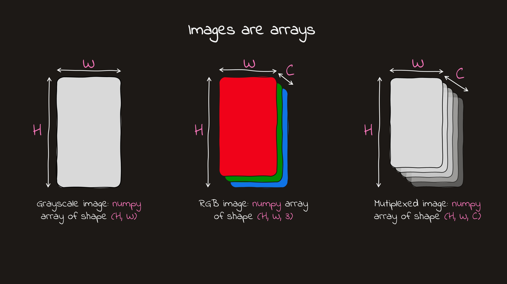
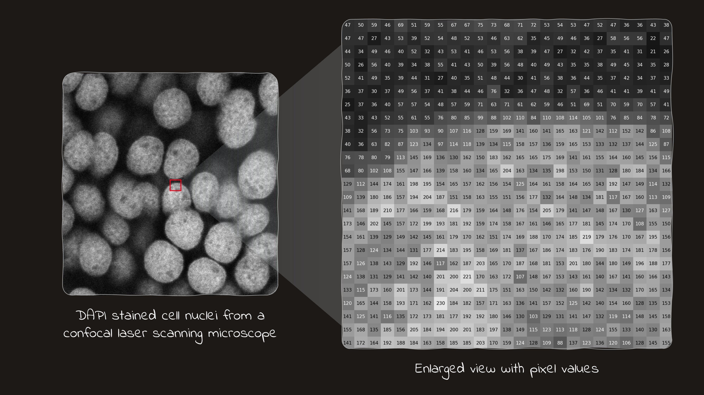

---
jupyter:
  jupytext:
    default_lexer: ipython3
    formats: ipynb,md
    text_representation:
      extension: .md
      format_name: markdown
      format_version: '1.3'
      jupytext_version: 1.19.1
  kernelspec:
    display_name: jb
    language: python
    name: python3
---

# Introduction to bioimage analysis

```{note} Plan
- Why images matter in modern biology
- Core image basics: pixels, shapes, channels, and intensity
- How to load simple images in Python
- Common conventions in `scikit-image` and `OpenCV`
- Why noise and metadata matter for later analysis
```

In recent years, biology has become increasingly spatial: it is no longer enough to know what molecules are present—we also want to know **where** they are in tissue. This shift is reflected in the choices of Nature Methods “Method of the Year”: spatially resolved transcriptomics in 2020 and spatial proteomics in 2024.

Both advances rely on images as a primary data source. That makes bioimage analysis not a “nice-to-have”, but the bridge between raw spatial measurements and biological insight.

::::{grid} 2
:::{grid-item}
[](https://www.nature.com/articles/s41592-024-02565-3)
:::
:::{grid-item}
[](https://www.nature.com/articles/s41592-020-01042-x)
:::
::::

```{admonition} Time-capsule note
:class: dropdown

If you are reading this from the future and these “Method of the Year” picks have changed—great, science kept moving. In *our* timeline: **2020 = spatial transcriptomics**, **2024 = spatial proteomics**. Either way, the message still stands: biology is getting **more spatial**, and images are the data.
```

## What is bioimage analysis?

Bioimage analysis is the process of turning biological images into numbers you can trust. A microscope gives you pixels; analysis gives you answers: how many cells are present, how large they are, how bright they are, where they are located, and how they change across conditions.

A helpful way to think about it: an image is a crowded stadium photo. Your biological question is rarely “what does the stadium look like?”—it is more often “how many people are there, where are they sitting, and what are they doing?” Bioimage analysis is the set of methods that turns that photo into a count, a map, and a table of measurements.

In this book the main focus is **Python**, because it is flexible, popular, and integrates well with scientific computing, statistics, and machine learning.

**Core Python packages used in this chapter:**

[](https://numpy.org/)
[](https://matplotlib.org/)
[](https://scikit-image.org/)
[](https://opencv.org/)

```{note}
You do not need to master every library at once. The important skill is learning what kind of object each library returns, and what conventions it uses.
```

## Set up Python environment

Before we touch pixels, let us make sure the basic tools are installed. Bioimage analysis often combines “scientific Python” (arrays, plots, statistics) with “image Python” (TIFF files, channels, filters, microscopy metadata). A clean environment helps keep these tools working together.

### Option A: `conda`

Conda is popular in scientific imaging because it handles compiled dependencies smoothly.

```bash
# 1) Create a fresh environment
conda create -n bioimg python=3.12 -y

# 2) Activate it
conda activate bioimg

# 3) Install core packages for this chapter
pip install opencv-python numpy matplotlib scikit-image
```

### Option B: `venv` + `pip`

If you prefer to avoid `conda`, use Python’s built-in environment tools.

```bash
python -m venv .venv

# macOS/Linux
source .venv/bin/activate

# Windows (PowerShell)
# .\.venv\Scripts\Activate.ps1
```

Then install packages:

```bash
pip install -U pip
pip install numpy matplotlib scikit-image opencv-python
```

## Image basics

Before we analyze images, we need to load them correctly and understand what kind of data we are working with. In bioimage analysis, this step is more important than it may first appear, because biological images come in many formats and often carry important metadata.

### Image file formats

Not all image files are created equal. The format determines:

- how pixel data is stored
- whether metadata is preserved, such as pixel size or channel information
- how easy it is to load the image in Python

**Common formats you will encounter:**

| Format | Description | Typical use |
| --- | --- | --- |
| `.png`, `.jpg` | Standard image formats | Figures, demos, quick visualization |
| `.tif` / `.tiff` | Flexible format that can store multi-dimensional data | Microscopy |
| `.ome.tif` | TIFF plus standardized microscopy metadata | Bioimaging workflows |
| `.czi`, `.lif`, `.nd2`, ... | Proprietary microscope formats | Raw acquisition data |

A practical point to remember: two files may contain similar pixel values, but very different amounts of metadata. In bioimage analysis, metadata often matters because it tells you things like pixel size, channels, z-slices, or timepoints.

```{note}
For this first lesson we will use simple image files such as `.png` so we can focus on the basic ideas. Real microscopy data is often grayscale, multi-channel, 16-bit, and stored in TIFF-like formats rather than RGB photographs.
```

### Images are arrays

[](images/chapter-1/Slide1.JPG)

Once an image is loaded into Python, it is usually represented as a **NumPy array**. That means an image is not a special magical object. It is numerical data arranged on a grid. For a grayscale image, the shape is often:
- `(H, W)`

[](images/chapter-1/Slide2.JPG)

For a color image, the shape is often:
- `(H, W, 3)` where: `H` = height, `W` = width, `3` = three color channels

So when you inspect an image in Python, one of the first things to check is:

- its shape
- its data type (`dtype`)
- its value range

Those three properties already tell you a lot about what kind of image you have.

### Loading standard images with `scikit-image`

Let us start with `scikit-image`, a library that is widely used in scientific Python and bioimage analysis. It works naturally with NumPy arrays and plays nicely with `matplotlib`.

```python
from skimage import io
import matplotlib.pyplot as plt

img = io.imread("example.png")

plt.imshow(img)
plt.title("scikit-image")
plt.axis("off")

print("Shape:", img.shape)
print("Type of the object:", type(img))
print("Dtype:", img.dtype)
print("Min/Max:", img.min(), img.max())
```

This reads the image into a NumPy array. For a color image, `scikit-image` uses **RGB** channel order, which matches what `matplotlib` expects.

At this point, the most important observation is simple: even though we display it as an image, Python sees it as an array.

### Looking at image channels

If `img.shape` is `(H, W, 3)`, then the last axis stores the color channels. We can inspect them one by one.

```python
from skimage import io
import matplotlib.pyplot as plt

img = io.imread("example.png")

print(f"Data type: {img.dtype}")
print(f"Shape: {img.shape}")

plt.figure(figsize=(15, 5))

plt.subplot(1, 3, 1)
plt.imshow(img[:, :, 0], cmap="Reds")
plt.title("Channel 0")
plt.axis("off")

plt.subplot(1, 3, 2)
plt.imshow(img[:, :, 1], cmap="Greens")
plt.title("Channel 1")
plt.axis("off")

plt.subplot(1, 3, 3)
plt.imshow(img[:, :, 2], cmap="Blues")
plt.title("Channel 2")
plt.axis("off")

plt.tight_layout()
plt.show()
```

Each slice, such as `img[:, :, 0]`, is just a 2D array of shape `(H, W)`.

For learners already comfortable with arrays, this is the main connection to make: image analysis starts with familiar array operations. Later, we will use the same idea for masking, measuring, filtering, and extracting signal from specific channels.

```{note}
This example assumes a 3-channel color image. A grayscale image usually has shape `(H, W)`, so indexing it as `img[:, :, 0]` would fail.
```

### Loading the same image with `OpenCV`

Now let us load the same file with `OpenCV`.

`OpenCV` is also a very common image-processing library. Just like `scikit-image`, it returns a NumPy array.

```python
import cv2
import matplotlib.pyplot as plt

img = cv2.imread("example.png")

print("Shape:", img.shape)
print("Type of the object:", type(img))
print("Dtype:", img.dtype)
print("Min/Max:", img.min(), img.max())

plt.imshow(img)
plt.title("OpenCV (raw)")
plt.axis("off")
```

At first glance, this looks very similar. But the displayed colors may be wrong.

Why? Because `OpenCV` uses a different color convention:

- `scikit-image` uses **RGB**
- `OpenCV` uses **BGR**

So the main lesson is not that the libraries return different kinds of objects—they do not. They both return arrays. The difference is in the **conventions** they use.

To display an OpenCV image correctly with `matplotlib`, convert it to RGB first:

```python
img_rgb = cv2.cvtColor(img, cv2.COLOR_BGR2RGB)

plt.imshow(img_rgb)
plt.title("OpenCV (converted to RGB)")
plt.axis("off")
```

```{admonition} Small but useful habit
:class: tip

When you load an image, get into the habit of checking:

- `img.shape`
- `img.dtype`
- `img.min(), img.max()`

These quick checks often catch mistakes early.
```

### Manual channel reordering

It is also useful to know that channel order can be changed by array slicing.

```python
img_rgb = img[:, :, ::-1]
```

This reverses the last axis, turning BGR into RGB.

### Image intensity

Image intensity is the numerical value stored at each pixel. In a grayscale image, that value directly represents brightness. In a color image, each channel has its own intensity values.

For simple 8-bit images, values often range from:

- `0` = black
- `255` = bright

But not all images follow this range. Many microscopy images use 16-bit values, and the meaning of the intensity depends on how the image was acquired and stored.

In microscopy, intensity is influenced by many factors, including:

- staining
- exposure time
- detector gain
- optics
- the underlying biology

That means intensity is not “just brightness”. It is often part biological signal and part acquisition setup. When you compare intensities across images, you should always think about whether the images were collected under comparable conditions.

### Noise

Real images are never perfect. Most images contain some amount of **noise**, meaning unwanted variation in pixel values.

In biological imaging, noise can come from:

- low light levels
- the detector or camera electronics
- short exposure times
- the stochastic nature of photon detection

Noise matters because it can make structures harder to see and measurements less stable. For example, if you want to measure the brightness of a dim cell, noise can make that value less reliable.

At this stage, the main idea is simple: not every bright or dark pixel reflects biology. Some of the variation comes from the imaging process itself.

## Recap

In this lesson, we introduced the basic mindset for working with images in Python:

- images are numerical arrays
- shape, data type, and value range are the first things to inspect
- different libraries may load the same file with different conventions
- intensity values depend on both biology and acquisition
- noise is part of real imaging data and affects later analysis

In the next lessons, we will build on these basics and look at tools for inspecting image values more carefully, such as contrast, histograms, and simple preprocessing.
