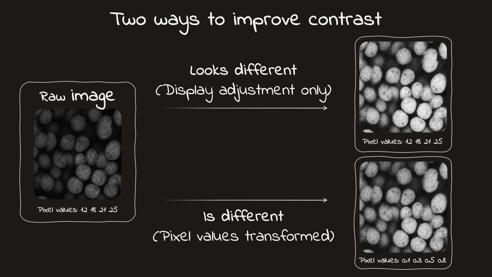
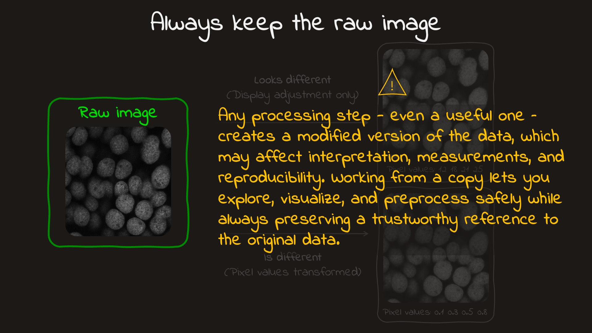
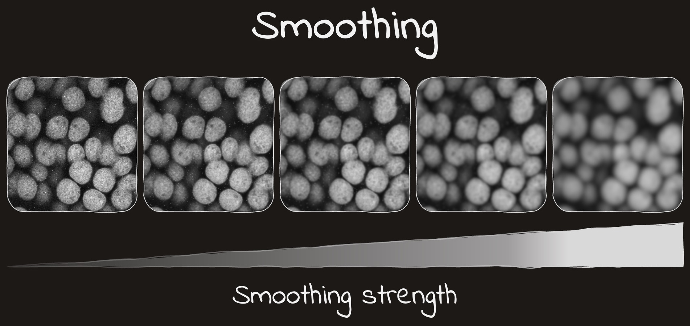

---
kernelspec:
    name: python3
    display_name: 'Python 3'
---
# Classical image processing

Biological images are rarely ready for analysis straight out of the microscope. They often come with noise, uneven background, low contrast, or other little imperfections that make important structures harder to see and measure. So before we start counting cells, measuring intensity, or drawing conclusions, we usually need to clean things up a bit.

That is where classical image processing comes in. It gives us a set of simple, interpretable tools for adjusting intensity, reducing noise, enhancing structure, and separating foreground from background. These methods are still widely used because they are fast, transperent, and often work surprisingly well. In this chapter, we will start to build a practical toolkit for preparing images for segmentation and measurement.

## Adjusting intensity and contrast

Biological images often contain useful structure that is hard to see at first glance. A signal may be present, but if the intensity range is narrow, the image can look dim, flat, or low-contrast. In practice, we often “improve” such images — but that phrase can mean two very different things, and the difference matters.

Sometimes we only change **how the image is shown on screen**. Other times we change the **pixel values themselves**. These two operations can produce similar-looking results visually, but they are not the same scientifically. One leaves the data untouched; the other creates a modified version of the image.

:::{figure}
:label: fig-lut-adjustment
:align: center

<a href="images/chapter-2/Slide4.JPG" target="_blank" rel="noopener noreferrer">
  
</a>

Two different approaches for intensity/contrast adjustment
:::

### Display adjustment: better visibility without changing the data

The first type of contrast adjustment changes only the **mapping from pixel values to displayed brightness**. The underlying array stays exactly the same.

This is commonly done by setting display limits in an image viewer. For example, values below some lower bound may be shown as black, values above some upper bound as white, and the values in between are stretched across the visible grayscale. This is often handled through a **lookup table (LUT)** or a display-range setting.

The important point is that the image may look very different, while the data itself has not changed. The objects are in the same place, the pixel values are identical, and any measurements computed from the original image remain the same.

This kind of adjustment is extremely useful for exploration. It helps us inspect dim structures, compare regions by eye, and get a better sense of what is present in the data. In microscopy, that is often the right first move: before modifying the image, first check whether you only need a better way to view it.

### Pixel-value transformation: changing the data itself

The second type of adjustment changes the **actual pixel intensities** in the image array.

Examples include:

* rescaling intensities,
* normalizing to a standard range such as `0` to `1`,
* clipping extreme values,
* gamma correction,
* histogram equalization.

These operations can also improve contrast, but they do so by creating a transformed version of the image. After such a step, the pixel values are no longer the same as in the original data.

That does not mean these methods are bad. On the contrary, they are often very useful in preprocessing pipelines. But once pixel values are changed, the transformation becomes part of the analysis workflow and should be treated seriously.

### Why the distinction matters

In bioimage analysis, intensity is often not just decoration — it may carry biological meaning. If pixel values represent fluorescence signal, protein abundance, or some other measured quantity, then changing those values can affect downstream results.

For example, a nucleus may have one mean intensity in the raw image and a different mean intensity after normalization or equalization. If your goal is only to visualize the nucleus more clearly, that may not matter. But if your goal is to compare intensity across cells or conditions, then such transformations must be used very carefully.

This is why you should build a simple habit early:

* **Display adjustment** is mainly for seeing better.
* **Pixel transformation** is for processing, and it may affect measurements.

```{warning}
A nicer-looking image is not automatically a more reliable one. Strong contrast enhancement can make structures easier to see, but it can also exaggerate noise or hide subtle intensity relationships. Even display-only adjustments can be misleading, since the same image may look quite different under different display settings.

If you do change pixel values, treat that as part of the analysis pipeline and document it carefully. A good habit is to always keep the original image unchanged and apply transformations to a copy.

```

:::{figure}
:label: fig-lut-adjustment
:align: center

<a href="images/chapter-2/Slide5.JPG" target="_blank" rel="noopener noreferrer">
  
</a>

Two different approaches for intensity/contrast adjustment
:::


## Smoothing and denoising

Biological images are almost never perfectly clean. Even with good acquisition, they usually contain noise — small intensity fluctuations that do not reflect the real biological structure. One common way to reduce this noise is smoothing, where each pixel is replaced by a value influenced by its neighbors. This suppresses rapid pixel-to-pixel variation and can make larger structures easier to see.

Smoothing is often helpful, but it always comes with a tradeoff. Along with noise, it can also blur edges, weaken small objects, or hide fine detail. So the goal is not to smooth as much as possible, but to smooth just enough for the task at hand.

### A local operation

Smoothing is a **local** image transformation. That means the new value of a pixel depends not only on that pixel itself, but also on the values around it. In practice, this is often done with a small neighborhood, sometimes called a **kernel** or **window**.

You do not need the full mathematical formalism right away. The intuition is enough: a smoothing filter looks at a local patch of the image and combines nearby values into something less noisy and more stable.

:::{figure}
:label: fig-smoothing
:align: center

<a href="images/chapter-2/Slide6.JPG" target="_blank" rel="noopener noreferrer">
  
</a>

Smoothing effect on the image with varying strengths
:::

### Common types of smoothing filters

There are several classical ways to smooth an image, and they do not all behave in the same way.

#### Mean filter

A **mean filter** replaces each pixel with the average of its neighbors. This is one of the simplest possible smoothing operations.

It is easy to understand, but it also tends to blur edges quite strongly. Because of that, it is useful mainly as a first conceptual example rather than the best default choice for microscopy.

#### Gaussian filter

A **Gaussian filter** is one of the most common smoothing methods in image processing. Like the mean filter, it averages nearby values, but it gives more weight to pixels near the center and less weight to pixels farther away.

This usually produces a smoother and more natural-looking result than a simple mean filter. In bioimage analysis, Gaussian smoothing is often a reasonable default when you want to reduce moderate noise before further processing.

A key parameter here is the **scale** of the filter, often described by `sigma`. A small `sigma` produces mild smoothing, while a larger `sigma` produces stronger smoothing. As `sigma` increases, noise is reduced more aggressively, but fine detail is also more likely to disappear.

#### Median filter

A **median filter** replaces each pixel with the median value in its local neighborhood instead of the mean.

:::{figure} ./images/chapter-2/median-filter.mp4
Video illustration of the median filter
:::

This makes it especially useful for removing isolated bright or dark outliers, sometimes called “salt-and-pepper” noise. Compared with averaging filters, the median filter can preserve edges better in some cases, although it is not a universal replacement for Gaussian smoothing.

### Smoothing is task-dependent

There is no single “correct” amount of smoothing for all images. The best choice depends on the type of image, the size of the structures of interest, and what you want to do next.

For example:

* If your goal is simple visualization, mild smoothing may make the image easier to inspect.
* If your goal is thresholding, smoothing may help reduce small noisy fluctuations that would otherwise create false positives.
* If your goal is measuring tiny structures, too much smoothing may erase the very features you care about.

So in practice, smoothing should always be chosen with the biological question in mind.

```{admonition} Warning
:class: warning

Smoothing can be very useful, but it is never free. A cleaner-looking image may also have blurred edges, weaker peaks, or lost small objects. Since denoising changes pixel values, it becomes part of the analysis pipeline. A good habit is to compare the raw and smoothed images side by side and use the mildest smoothing that helps the next step.
```

## Detecting edges and structures

## Correcting uneven background

## Thresholding images

## Pitfalls, interpretation and recap


