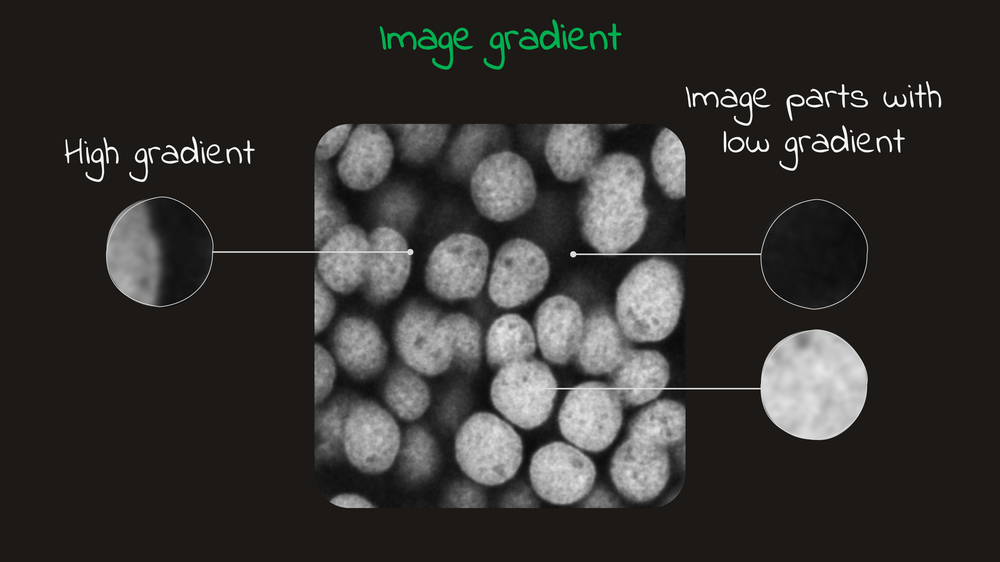
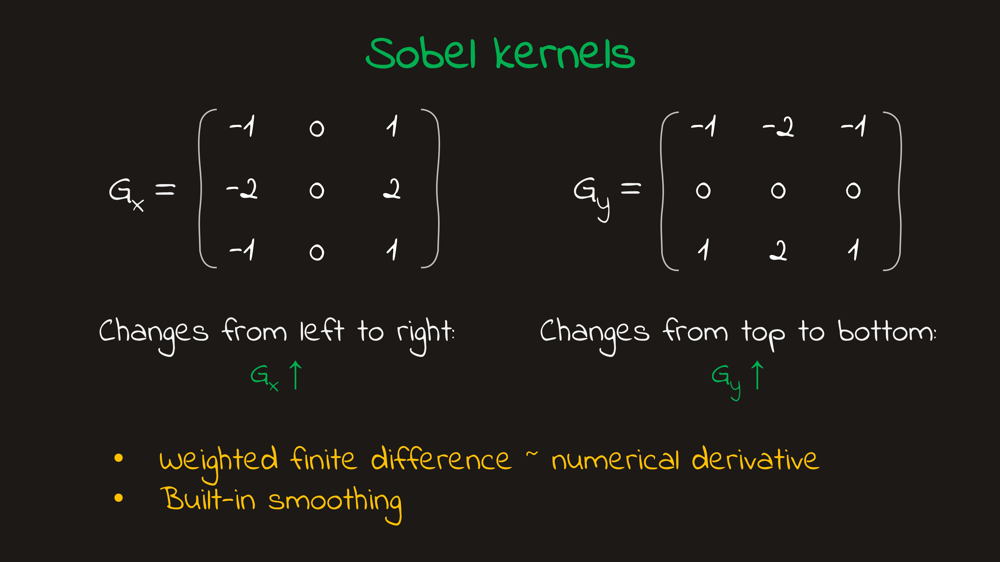

---
kernelspec:
    name: python3
    display_name: 'Python 3'
---
# Classical image processing

Biological images are rarely ready for analysis straight out of the microscope. They often come with noise, uneven background, low contrast, or other little imperfections that make important structures harder to see and measure. So before we start counting cells, measuring intensity, or drawing conclusions, we usually need to clean things up a bit.

That is where classical image processing comes in. It gives us a set of simple, interpretable tools for adjusting intensity, reducing noise, enhancing structure, and separating foreground from background. These methods are still widely used because they are fast, transperent, and often work surprisingly well. In this chapter, we will start to build a practical toolkit for preparing images for segmentation and measurement.

:::{note} Generic imports for our python code
:class: dropdown

```{code-cell}
from skimage import io, filters, util
import numpy as np
import matplotlib.pyplot as plt

plt.style.use('dark_background')

```
:::


```{code-cell}
:tags: [remove-cell]
def inspect_image(img, name="img"):
    print(f"Name: {name}")
    print(f"Type: {type(img)}")
    print(f"Shape: {img.shape}")
    print(f"Dtype: {img.dtype}")
    print(f"Min: {img.min()}")
    print(f"Max: {img.max()}")
    print(f"Dimensions: {img.ndim}")

    if img.ndim == 2:
        print("Interpretation: grayscale image")
    elif img.ndim == 3:
        print(f"Interpretation: image with {img.shape[-1]} channels")
    else:
        print("Interpretation: higher-dimensional image")
```

## Adjusting intensity and contrast

Biological images often contain useful structure that is hard to see at first glance. A signal may be present, but if the intensity range is narrow, the image can look dim, flat, or low-contrast. In practice, we often “improve” such images — but that phrase can mean two very different things, and the difference matters.

Sometimes we only change **how the image is shown on screen**. Other times we change the **pixel values themselves**. These two operations can produce similar-looking results visually, but they are not the same scientifically. One leaves the data untouched; the other creates a modified version of the image.

:::{figure}
:label: fig-lut-adjustment
:align: center

<a href="images/chapter-2/Slide4.JPG" target="_blank" rel="noopener noreferrer">
  
</a>

Two different approaches for intensity/contrast adjustment
:::

### Display adjustment: better visibility without changing the data

The first type of contrast adjustment changes only the **mapping from pixel values to displayed brightness**. The underlying array stays exactly the same.

This is commonly done by setting display limits in an image viewer. For example, values below some lower bound may be shown as black, values above some upper bound as white, and the values in between are stretched across the visible grayscale. This is often handled through a **lookup table (LUT)** or a display-range setting.

The important point is that the image may look very different, while the data itself has not changed. The objects are in the same place, the pixel values are identical, and any measurements computed from the original image remain the same.

This kind of adjustment is extremely useful for exploration. It helps us inspect dim structures, compare regions by eye, and get a better sense of what is present in the data. In microscopy, that is often the right first move: before modifying the image, first check whether you only need a better way to view it.

In the following example, we will adjust the image rendering by using the `vmin` and `vmax` arguments of the `matplotlib.pyplot` function. First, we will load the image and [check some basic properties](inspect-image-code):
```{code-cell}
url = 'https://github.com/vdsukhov/bioimage-analysis-course/blob/main/data/images/dapi.png?raw=true'

img = io.imread(url)
inspect_image(img)
```

Now let's plot the original image alongside the image with adjusted `vmin` and `vmax` values:
```{code-cell}
fig, axs = plt.subplots(1, 2, figsize = (8, 5))
fig.subplots_adjust(wspace=0.03)

axs[0].imshow(img, cmap='gray')
axs[0].set_title('Original image')
axs[0].axis('off')

axs[1].imshow(img, cmap='gray', vmin = 32, vmax=168)
axs[1].set_title('Custom vmin and vmax')
axs[1].axis('off')
```

As you can see, the image on the right looks different from the one on the left. However, the original image remains untouched. Let's verify this by calling `inspect_image` once more:
```{code-cell}
inspect_image(img)
```


### Pixel-value transformation: changing the data itself

The second type of adjustment changes the **actual pixel intensities** in the image array.

Examples include:

* rescaling intensities,
* normalizing to a standard range such as `0` to `1`,
* clipping extreme values,
* gamma correction,
* histogram equalization.

These operations can also improve contrast, but they do so by creating a transformed version of the image. After such a step, the pixel values are no longer the same as in the original data.

That does not mean these methods are bad. On the contrary, they are often very useful in preprocessing pipelines. But once pixel values are changed, the transformation becomes part of the analysis workflow and should be treated seriously.

Now, let's examine the case where we change the underlying image. We will calculate and display the log-scaled image.

```{code-cell}
logimg = img.copy()
logimg = np.log2(logimg - logimg.min() + 1)

fig, axs = plt.subplots(1, 2, figsize = (8, 5))
fig.subplots_adjust(wspace=0.03)

axs[0].imshow(img, cmap='gray')
axs[0].set_title('Original image')
axs[0].axis('off')

axs[1].imshow(logimg, cmap='gray')
axs[1].set_title('Log image')
axs[1].axis('off')
```

Now let's also inspect the `logimg`:
```{code-cell}
:tag: [hide-output]
inspect_image(logimg)
```

### Why the distinction matters

In bioimage analysis, intensity is often not just decoration — it may carry biological meaning. If pixel values represent fluorescence signal, protein abundance, or some other measured quantity, then changing those values can affect downstream results.

For example, a nucleus may have one mean intensity in the raw image and a different mean intensity after normalization or equalization. If your goal is only to visualize the nucleus more clearly, that may not matter. But if your goal is to compare intensity across cells or conditions, then such transformations must be used very carefully.

This is why you should build a simple habit early:

* **Display adjustment** is mainly for seeing better.
* **Pixel transformation** is for processing, and it may affect measurements.

```{warning}
A nicer-looking image is not automatically a more reliable one. Strong contrast enhancement can make structures easier to see, but it can also exaggerate noise or hide subtle intensity relationships. Even display-only adjustments can be misleading, since the same image may look quite different under different display settings.

If you do change pixel values, treat that as part of the analysis pipeline and document it carefully. A good habit is to always keep the original image unchanged and apply transformations to a copy.

```

:::{figure}
:label: fig-lut-adjustment
:align: center

<a href="images/chapter-2/Slide5.JPG" target="_blank" rel="noopener noreferrer">
  
</a>

Two different approaches for intensity/contrast adjustment
:::


## Smoothing and denoising

Biological images are almost never perfectly clean. Even with good acquisition, they usually contain noise — small intensity fluctuations that do not reflect the real biological structure. One common way to reduce this noise is smoothing, where each pixel is replaced by a value influenced by its neighbors. This suppresses rapid pixel-to-pixel variation and can make larger structures easier to see.

Smoothing is often helpful, but it always comes with a tradeoff. Along with noise, it can also blur edges, weaken small objects, or hide fine detail. So the goal is not to smooth as much as possible, but to smooth just enough for the task at hand.

### A local operation

Smoothing is a **local** image transformation. That means the new value of a pixel depends not only on that pixel itself, but also on the values around it. In practice, this is often done with a small neighborhood, sometimes called a **kernel** or **window**.

You do not need the full mathematical formalism right away. The intuition is enough: a smoothing filter looks at a local patch of the image and combines nearby values into something less noisy and more stable.

:::{figure}
:label: fig-smoothing
:align: center

<a href="images/chapter-2/Slide6.JPG" target="_blank" rel="noopener noreferrer">
  
</a>

Smoothing effect on the image with varying strengths
:::

### Common types of smoothing filters

There are several classical ways to smooth an image, and they do not all behave in the same way.

#### Median filter

A **median filter** replaces each pixel with the median value in its local neighborhood instead of the mean.

:::{figure} ./images/chapter-2/median-filter.mp4
Video illustration of the median filter
:::

This makes it especially useful for removing isolated bright or dark outliers, sometimes called “salt-and-pepper” noise. Compared with averaging filters, the median filter can preserve edges better in some cases, although it is not a universal replacement for Gaussian smoothing.

::::{tab-set}

:::{tab-item} Abstract example
```{code-cell}
A = np.array(
    [
        [27, 40, 35, 51],
        [41, 38, 255, 46],
        [48, 57, 59, 71],
        [0, 80, 85, 99]
    ]
)

kernel = np.ones((3, 3))
result = filters.median(A, kernel)
print(result)
```

:::

:::{tab-item} Median filter applied to an image
```{code-cell}
url = "https://github.com/vdsukhov/bioimage-analysis-course/blob/main/data/images/snp-high.jpg?raw=true"

img = io.imread(url)

kernel = np.ones((3, 3))
res = filters.median(img, kernel)

fig, axs = plt.subplots(1, 2, figsize = (8, 5))
axs[0].imshow(img, cmap ='gray')
axs[0].set_title('Before')
axs[0].axis('off')

axs[1].imshow(res, cmap='gray')
axs[1].set_title('After')
axs[1].axis('off')

plt.show()
```
:::

::::

#### Mean filter

A **mean filter** replaces each pixel with the average of its neighbors. This is one of the simplest possible smoothing operations.

It is easy to understand, but it also tends to blur edges quite strongly. Because of that, it is useful mainly as a first conceptual example rather than the best default choice for microscopy.

:::{figure} ./images/chapter-2/mean-filter.mp4
Video illustration of the mean filter
:::


::::{tab-set}

:::{tab-item} Abstract example
```{code-cell}
A = np.array(
    [
        [0, 0, 0],
        [0, 255, 0],
        [0, 0, 0]
    ],
    dtype = np.uint8
)

kernel = np.ones((3, 3))
result = filters.rank.mean(A, kernel)
print(result)
```

:::

:::{tab-item} Mean filter applied to an image
```{code-cell}
url = "https://github.com/vdsukhov/bioimage-analysis-course/blob/main/data/images/snp-high.jpg?raw=true"
img = io.imread(url)

kernel = np.ones((3, 3))
res = filters.rank.mean(img, kernel)

fig, axs = plt.subplots(1, 2, figsize = (8, 5))
axs[0].imshow(img, cmap ='gray')
axs[0].set_title('Before')
axs[0].axis('off')

axs[1].imshow(res, cmap='gray')
axs[1].set_title('After')
axs[1].axis('off')

plt.show()
```
:::

::::


```{note}
A mean filter is not suitable for salt-and-pepper noise because averaging allows extreme pixel values to distort the result, causing blurring and spreading of noise. This type of noise contains sharp outliers that are better handled by a median filter, which preserves edges while removing them. However, a mean filter performs well for reducing Gaussian noise or other smoothly varying noise, where pixel values fluctuate gradually. In such cases, averaging helps smooth the image without being heavily affected by extreme values.
```


#### Gaussian filter

A **Gaussian filter** is one of the most common smoothing methods in image processing. Like the mean filter, it averages nearby values, but it gives more weight to pixels near the center and less weight to pixels farther away.

This usually produces a smoother and more natural-looking result than a simple mean filter. In bioimage analysis, Gaussian smoothing is often a reasonable default when you want to reduce moderate noise before further processing.

A key parameter here is the **scale** of the filter, often described by `sigma`. A small `sigma` produces mild smoothing, while a larger `sigma` produces stronger smoothing. As `sigma` increases, noise is reduced more aggressively, but fine detail is also more likely to disappear.


### Smoothing is task-dependent

There is no single “correct” amount of smoothing for all images. The best choice depends on the type of image, the size of the structures of interest, and what you want to do next.

For example:

* If your goal is simple visualization, mild smoothing may make the image easier to inspect.
* If your goal is thresholding, smoothing may help reduce small noisy fluctuations that would otherwise create false positives.
* If your goal is measuring tiny structures, too much smoothing may erase the very features you care about.

So in practice, smoothing should always be chosen with the biological question in mind.

```{admonition} Warning
:class: warning

Smoothing can be very useful, but it is never free. A cleaner-looking image may also have blurred edges, weaker peaks, or lost small objects. Since denoising changes pixel values, it becomes part of the analysis pipeline. A good habit is to compare the raw and smoothed images side by side and use the mildest smoothing that helps the next step.
```

## Detecting edges and structures

So far, we’ve focused on adjusting images, but sometimes we want **boundaries** and **shapes** to stand out. This is where edge detection helps.
An **edge** occurs where intensity changes sharply, often marking transitions between objects or regions, like a cell boundary.

Instead of asking *“where is the image bright?”*, we ask *“where does it change?”* Smooth bright areas don’t form strong edges, while sharp intensity changes—even in dim regions—do.
:::{figure}
:label: image-gradient
:align: center

<a href="images/chapter-2/Slide7.JPG" target="_blank" rel="noopener noreferrer">
  
</a>

Examples of image gradients
:::


This is captured by the **image gradient**:

* **Small gradient** → little change
* **Large gradient** → strong change, likely an edge


Many classic edge-detection methods rely on this principle.

### Common edge filters

#### Sobel filter

One of the most common classical edge detectors is the **Sobel filter**. The main idea is to measure how strongly the image intensity changes in different directions. Instead of looking only at pixel values themselves, the Sobel filter looks at how those values vary across a small local neighborhood.

It does this using two small matrices, often called **kernels**. One kernel responds strongly to horizontal intensity changes, and the other responds strongly to vertical intensity changes:

$$\label{sobel-kernels}
G_x =
\begin{bmatrix}
-1 & 0 & 1 \\
-2 & 0 & 2 \\
-1 & 0 & 1
\end{bmatrix}
\qquad
G_y =
\begin{bmatrix}
-1 & -2 & -1 \\
0 & 0 & 0 \\
1 & 2 & 1
\end{bmatrix}
$$

You can think of these kernels as tiny detectors that slide across the image. At each position, they compare one side of the neighborhood to the other. If the intensity changes strongly from left to right, the response of $G_x$ will be large. If it changes strongly from top to bottom, the response of $G_y$ will be large.

<!-- :::{figure}
:label: image-sobel-kernels
:align: center

<a href="images/chapter-2/Slide8.JPG" target="_blank" rel="noopener noreferrer">
  
</a>

Sobel kernels
::: -->

So the Sobel filter does not ask whether a region is bright or dark. It asks whether there is a **strong local change** in brightness. That is why it is useful for highlighting boundaries: edges often appear exactly where intensity changes quickly across space.

In practice, we usually combine the horizontal and vertical responses into a single edge-strength image. Conceptually, this means:

* $G_x$ tells us about changes in one direction
* $G_y$ tells us about changes in the other direction
* together they give an overall estimate of how strong the edge is at each pixel

A common way to combine them is to treat $G_x$ and $G_y$ as two components of the local gradient and compute its magnitude:

$$G = \sqrt{G_x^2 + G_y^2}$$

This formula gives a single value that summarizes how strong the intensity change is, regardless of its direction. If either horizontal or vertical change is large, then $G$ will also be large. If both are small, then the pixel is likely part of a more uniform region.

The result is an image where strong boundaries appear bright and more uniform regions appear dark. This makes outlines and transitions easier to see, even when the original image is not very visually clear.

A nice feature of the Sobel kernels is that they do a little bit of smoothing and edge detection at the same time. That makes them more stable than a very naive pixel-difference calculation, although they can still respond strongly to noise. For that reason, Sobel filtering often works best when the image has already been denoised at least mildly.

Now, let's see them in action. First, we will define the function `get_sobel`, which takes an image and applies Sobel kernels:
::::{tab-set}

:::{tab-item} Definition
```{code-cell}
from scipy.signal import convolve2d

def get_sobel(img):
  sobelx = np.array([
      [-1, 0, 1],
      [-2, 0, 2],
      [-1, 0, 1]
  ])

  sobely = sobelx.T

  imgx = convolve2d(img, sobelx, boundary='symm')
  imgy = convolve2d(img, sobely, boundary='symm')
  G = np.sqrt(imgx ** 2 + imgy ** 2)

  G = np.abs((G - G.min()) / (G.max() - G.min()))
  G = img_as_ubyte(G)

  return G
```

:::

:::{tab-item} Toy example
```{code-cell}
from skimage.util import img_as_ubyte

H = 250
R = np.round(H // 2 * 0.75).astype(int)
canvas = np.zeros((H, H))
y, x = np.ogrid[:H, :H]

cy, cx = H // 2, H // 2
mask = (x - cx) ** 2 + (y - cy) ** 2 <= R ** 2
canvas[mask] = 1

fig, axs = plt.subplots(1, 2, figsize=(8, 5))
fig.subplots_adjust(wspace=0.03)

axs[0].imshow(canvas, cmap='gray')
axs[0].axis('off')
axs[0].set_title('Original image')

axs[1].imshow(get_sobel(canvas), cmap='gray')
axs[1].axis('off')
axs[1].set_title('Sobel filter')
```
:::

:::{tab-item} Microscopy image
```{code-cell}
fig, axs = plt.subplots(1, 2, figsize=(8, 5))
fig.subplots_adjust(wspace=0.03)

img_smooth = filters.gaussian(img, sigma=3)

axs[0].imshow(img_smooth, cmap='gray')
axs[0].axis('off')

G = get_sobel(img_smooth)
axs[1].imshow(G, cmap='gray')
axs[1].axis('off')

plt.imshow(G, cmap='gray')
plt.gca().axis('off')
```
:::

::::


#### Laplacian-style filters

Another family of methods looks at how intensity changes relative to the surrounding neighborhood in a slightly different way. These filters are often useful for emphasizing fine structure and transitions, but they can also be more sensitive to noise.

That sensitivity matters because noise itself creates rapid local variation. For that reason, edge detection is often more stable when applied after at least mild smoothing.

### Edges reveal structure, but they are not objects

It is important to remember that an edge image is not the same thing as a segmentation. Edge detection highlights **transitions** and **boundaries**, but it does not automatically tell us which pixels belong to an object. A nucleus, for example, may appear as a bright ring-like boundary in an edge map, while its interior stays relatively dark.

Even so, edge detection is very useful in bioimage analysis. Some biological structures are easier to identify by their outline than by their absolute brightness, and edge-based views can reveal organization that is harder to notice in the raw image alone. More broadly, they encourage a different way of reading an image: not just as a map of intensities, but as a map of spatial change.


```{admonition} Warning
:class: warning

Edge filters respond to rapid intensity changes, but noise also creates rapid local variation. This means an edge image can highlight noise as well as real biological boundaries. A good habit is to compare the edge image with the original image and, if needed, apply mild smoothing first.
```


## Correcting uneven background

In an ideal image, the background would be nicely uniform: dark where there is no signal, brighter only where real biological structures are present. In practice, that often does not happen. Many images have a background that changes across the field of view, so one side of the image may look brighter than the other even when the biology is similar.

This kind of uneven background can come from several sources, such as uneven illumination, autofluorescence, optical artifacts, or out-of-focus light. Whatever the cause, the result is the same: objects become harder to judge against their surroundings. A cell that is easy to detect in one region may become much less obvious in another simply because the local background is different.

This becomes a real problem for downstream analysis. For example, a global threshold may work well in one part of the image and fail in another. More broadly, uneven background can make intensity-based measurements less stable and harder to interpret.

### One simple way to correct it

A common idea is to estimate the background as a **very smooth version of the image**. The reasoning is that the background usually changes slowly across space, while objects such as cells or nuclei are smaller and more localized. If we smooth the image strongly enough, much of the fine structure is suppressed and the broad background variation remains. Once we have a smooth estimate of the background, we can adjust it using two approaches.

Subtractive correction
: We subtract the estimated background from the original image: $I_{corr}(x, y) = I(x, y) - B(x, y)$ where $I(x, y)$ is the original image intensity at pixel $(x, y)$, $B(x, y)$ is the smooth background estimate, and $I_{corr}(x, y)$ is the corrected image. Use this when the background behaves like an additive offset or haze.

(div-correction)=
Divisive correction
: We divide the original image by the estimated background: $I_{corr}(x,y) = I(x,y) / B(x,y)$. Use this when the background comes from uneven illumination of multiplicative shading.


The goal is not to remove all low-intensity pixels, but to remove the large-scale intensity trend so that objects are compared against a more even baseline.

```{admonition} Warning
:class: warning

Background correction can be very helpful, but it is not just a cosmetic adjustment. It changes pixel values and may remove real signal if the estimated background is too aggressive. A good habit is to compare the raw image, the estimated background, and the corrected image side by side.
```

### Real case example

Let’s look at a real-world case where an uneven background causes problems in downstream analysis. Here is the [link](https://forum.image.sc/t/how-to-remove-uneven-background-for-blob-detection-and-area-measurement/5455) to the original post.

**Summary of the issue:**
- The goal is to detect blobs and measure their area in microscopy-style images.
- The images suffer from a strongly uneven background (e.g., illumination gradients or shading), which interferes with accurate detection.

**Approach:**
To address this, we estimate the background by smoothing the image, then apply a divisive correction to the original image to normalize the intensity variations.

Here is the resized image from the original issue:
```{code-cell}
img = io.imread('https://github.com/vdsukhov/bioimage-analysis-course/blob/main/data/images/uneven-background.png?raw=true', as_gray=True)
fig = plt.figure(figsize = (4, 4))
plt.imshow(img, cmap='gray')
plt.gca().axis('off')
plt.show()
```

Now let's estimate background and use the [divisive correction](#div-correction):
```{code-cell}
back = filters.gaussian(img, sigma = 50)
img_corr = img / back

fig, axs = plt.subplots(1, 3, figsize=(10, 5))
fig.subplots_adjust(wspace=0.03)

axs[0].imshow(img, cmap = 'gray')
axs[0].set_title("Original image")
axs[0].axis('off')

axs[1].imshow(back, cmap = 'gray')
axs[1].set_title("Estimated background")
axs[1].axis('off')

axs[2].imshow(img_corr, cmap = 'gray')
axs[2].set_title("Corrected image")
axs[2].axis('off')

plt.show()
```

## Thresholding images

## Recap


