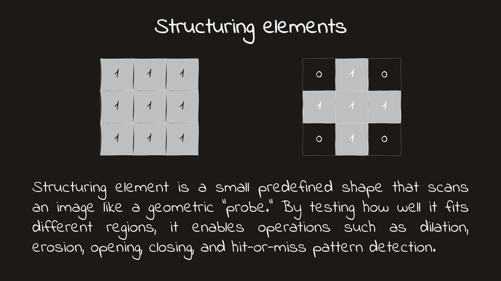
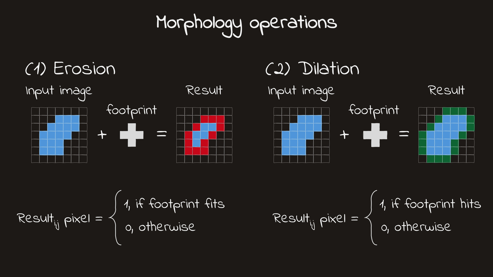

---
kernelspec:
    name: python3
    display_name: 'Python 3'
---

# Morphological operations

Thresholding gives us a binary image, but the result is often still messy: small specks may appear, objects may contain holes, and nearby structures may be connected. Morphological operations are simple tools that help clean up such masks by modifying object shape in a controlled way.

They work using a small local pattern called a **structuring element**, which is moved across the image to decide whether pixels should stay, be removed, or be added. In practice, morphology is often the next step after thresholding, when we want to refine a mask before measurement or further analysis.


:::{note} Imports for our python code
:class: dropdown

```{code-cell}
from skimage.morphology import disk, erosion, dilation
from skimage import io, filters, util
from skimage.util import img_as_bool, img_as_ubyte

import matplotlib.pyplot as plt
import numpy as np

plt.style.use('dark_background')

```
:::

## What morphology is
Morphology is a set of image-processing operations that work with the shape of objects. In this chapter, we will focus on binary images, where pixels are labeled as either foreground or background. Instead of asking how bright a pixel is, morphology asks whether that pixel should stay, disappear, or expand based on the pattern of pixels around it.

This makes morphology especially useful after thresholding. A threshold gives us a first binary mask, and morphology helps refine it by removing small artifacts, smoothing object outlines, filling gaps, or separating weak connections.

## Structuring elements

:::{figure}
:label: fig-se
:align: center

<a href="images/chapter-3/Slide12.JPG" target="_blank" rel="noopener noreferrer">
  
</a>

Structuring elements
:::

Morphological operations are defined by a small local pattern called a structuring element. You can think of it as a tiny template that moves across the image and checks the neighborhood around each pixel. The result of the operation depends on both the image and the shape of this template.

Structuring elements can have different shapes and sizes, such as a square or a disk. A larger structuring element produces a stronger effect, while a smaller one makes a more local change. This means the choice of structuring element is part of the analysis: it should be matched to the size and shape of the structures you want to preserve or remove.

:::{figure} ./images/chapter-3/fit-hit-1080.mp4
Video illustration for positioning of structuring element
:::

## Erosion

Erosion shrinks foreground objects. Intuitively, it removes pixels from object boundaries, making objects smaller and thinner. If an object is already very small, erosion may remove it completely.

This can be useful when we want to get rid of tiny foreground specks or break weak connections between nearby objects. At the same time, erosion should be used with care, because it can also remove real small structures or distort object shape if applied too strongly.


::::{tab-set}

:::{tab-item} Abstract example
```{code-cell}
A = np.array(
    [
        [0, 0, 0, 0, 0],
        [0, 1, 1, 1, 0],
        [0, 1, 1, 1, 0],
        [0, 1, 1, 1, 0],
        [0, 0, 0, 0, 0],
    ],
    dtype=bool
)

footprint = np.ones((3, 3), dtype=bool)
eroded = erosion(A, footprint=footprint)

fig, axs = plt.subplots(1, 2, figsize = (6, 4))

axs[0].imshow(A.astype(int), cmap='gray')
axs[0].axis('off')
axs[0].set_title("Before erosion")

axs[1].imshow(eroded.astype(int), cmap='gray')
axs[1].axis('off')
axs[1].set_title("After erosion")
```

:::

:::{tab-item} Example with simple shape
```{code-cell}
se = np.ones((9, 9), dtype = np.bool)

d = disk(100)
de = d.copy()

erosion_iterations = 10

for i in range(erosion_iterations):
  de = erosion(de, se)

fig, axs = plt.subplots(1, 2, figsize = (6, 4))

axs[0].imshow(d.astype(int), cmap='gray')
axs[0].axis('off')
axs[0].set_title("Before erosion")

axs[1].imshow(de.astype(int), cmap='gray')
axs[1].axis('off')
axs[1].set_title("After erosion")

plt.show()
```
:::

::::


## Dilation

Dilation does the opposite: it expands foreground objects. It adds pixels around object boundaries, making objects larger and thicker.

This is useful when we want to fill small gaps, strengthen thin structures, or reconnect regions that should belong together. But just like erosion, dilation is not free — if it is too strong, nearby objects may merge and boundaries may become less precise.


```{code-cell}
A = np.array(
    [
        [0, 0, 0, 0, 0],
        [0, 0, 1, 0, 0],
        [0, 0, 1, 0, 0],
        [0, 0, 1, 0, 0],
        [0, 0, 0, 0, 0],
    ],
    dtype=bool
)

footprint = np.ones((3, 3), dtype=bool)
dilated = dilation(A, footprint=footprint)

fig, axs = plt.subplots(1, 2, figsize = (6, 4))

axs[0].imshow(A.astype(int), cmap='gray')
axs[0].axis('off')
axs[0].set_title("Before dilation")

axs[1].imshow(dilated.astype(int), cmap='gray')
axs[1].axis('off')
axs[1].set_title("After dilation")
```

:::{figure}
:label: fig-erosion-dilation
:align: center

<a href="images/chapter-3/Slide15.JPG" target="_blank" rel="noopener noreferrer">
  
</a>

Illustration of morphology operations
:::

## Opening

Opening means applying erosion first and then dilation. At first that may sound like the two operations would simply cancel each other out, but in practice they do not. Small foreground objects or thin protrusions may disappear during erosion and then fail to come back during dilation.

This makes opening useful for removing small foreground specks, breaking thin connections, and smoothing object outlines while keeping larger structures mostly intact. In practice, it is often used when a binary mask contains small bright artifacts that should not be treated as real objects.

In the example below, the binary image contains one larger object and one small isolated speck. Opening removes the tiny foreground artifact while keeping the larger object.

```{code-cell}
from skimage.morphology import opening

A = np.array(
    [
        [0, 0, 0, 0, 0, 0],
        [0, 1, 1, 1, 0, 0],
        [0, 1, 1, 1, 0, 1],
        [0, 1, 1, 1, 0, 0],
        [0, 0, 0, 0, 0, 0],
    ],
    dtype=bool
)

footprint = np.ones((3, 3), dtype=bool)
opened = opening(A, footprint=footprint)

fig, axs = plt.subplots(1, 2, figsize = (6, 4))

axs[0].imshow(A.astype(int), cmap='gray')
axs[0].axis('off')
axs[0].set_title("Before opening")

axs[1].imshow(opened.astype(int), cmap='gray')
axs[1].axis('off')
axs[1].set_title("After opening")
```

The small isolated pixel disappears because it is too small to survive erosion. The larger object remains, since it is big enough to persist through the operation. This is the typical effect of opening: it removes small foreground features while preserving larger ones.


## Closing

Closing means applying dilation first and then erosion. Again, the two steps do not simply undo each other. Small background gaps or holes may be filled during dilation, and then remain filled after erosion.

This makes closing useful for filling small holes, bridging narrow gaps, and making object boundaries a bit smoother. In practice, it is often helpful when thresholding produces masks with tiny breaks or dark holes inside otherwise solid objects.


```{code-cell}
from skimage.morphology import closing

A = np.array(
    [
        [0, 0, 0, 0, 0],
        [0, 1, 1, 1, 0],
        [0, 1, 0, 1, 0],
        [0, 1, 1, 1, 0],
        [0, 0, 0, 0, 0],
    ],
    dtype=bool
)
A = np.pad(A, pad_width=1, mode='constant', constant_values=0)

footprint = np.ones((3, 3), dtype=bool)
closed = closing(A, footprint=footprint)

fig, axs = plt.subplots(1, 2, figsize = (6, 4))

axs[0].imshow(A.astype(int), cmap='gray')
axs[0].axis('off')
axs[0].set_title("Before closing")

axs[1].imshow(closed.astype(int), cmap='gray')
axs[1].axis('off')
axs[1].set_title("After closing")
```

```{admonition} Rule of thumb
:class: note

**Opening** = erosion + dilation → good for removing small foreground specks  
**Closing** = dilation + erosion → good for filling small holes and gaps
```

## Filling holes and removing small objects

After thresholding, a binary mask is often close to useful, but not quite there yet. Some objects may contain small holes inside them, and tiny isolated foreground specks may appear in the background. These imperfections are very common, especially when the image is noisy or the threshold is not perfect. In practice, a lot of segmentation cleanup comes down to handling exactly these two problems.

Two especially useful operations are filling holes and removing small objects. They are simple, but they can make a binary mask much easier to interpret and measure.

### Filling holes

A hole is a background region that is completely surrounded by foreground. In a binary mask, this appears as a dark region inside an otherwise solid object.

Whether a hole should be filled depends on the biological question. Sometimes a hole is just an artifact of thresholding and should be removed. For example, a nucleus may appear as a ring-like object even though we want to treat it as one solid region. In that case, filling holes is a reasonable cleanup step.

The important idea is that hole filling changes only enclosed background regions. It does not expand the object outward, but simply makes it solid inside.


### Removing small objects

A second common problem is the presence of tiny foreground components that are unlikely to be real structures. These often come from noise, dust, uneven staining, or thresholding errors. If they are much smaller than the objects we actually care about, it makes sense to remove them.

This is usually done by identifying connected foreground components and discarding those below a chosen size threshold. In other words, instead of modifying boundaries locally, we look at complete objects and ask whether they are large enough to keep.

That makes this operation especially practical: it is often a direct way to remove obvious false positives without changing the main objects too much.