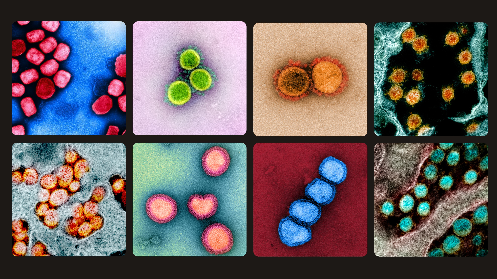

---
kernelspec:
  display_name: jb
  language: python
  name: python3
---


# Bioimage analysis



Turn messy microscopy images into clean, measurable biology — with **Python**.

**You’ll learn to:** segment cells, measure them, and discover patterns (from classical methods to U-Net).

---

## What’s inside

- **Image essentials**: intensity, noise, contrast, histograms
- **Classic toolbox**: filtering, thresholding, morphology, labeling, watershed  
- **Segmentation that actually works**: semantic vs instance  
- **Deep learning jump**: U-Net + augmentation + training basics  
- **From masks to insight**: features → PCA/UMAP → clustering

---

## Tiny taste of the book

```{code-cell}
from skimage import io
import matplotlib.pyplot as plt

url = 'https://github.com/vdsukhov/bioimage-analysis-course/blob/main/data/images/dapi.png?raw=true'

img = io.imread(url)
plt.imshow(img, cmap="gray")
plt.axis("off")
plt.gcf().set_facecolor('black')
plt.show()
```

## Course prerequisites

- Proficiency in the Python programming language
- Basic familiarity with NumPy and SciPy
- Intermediate-level experience using the command-line interface (CLI)